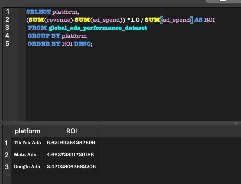

# Maha Kazmi - SQL Portfolio

I am a data-driven marketing professional with experience in communications and analytics. This portfolio showcases SQL projects focused on business insights and data storytelling.

## Projects
- Marketing Campaign Analysis
- Sales Performance Dashboard (coming soon)

## Skills
- SQL (Joins, Aggregations, CTEs, Window Functions)
- Data Analysis
- Marketing Analytics

-- Objective: Identify which campaign type generates the highest ROI

SELECT 
  campaign_type,
  SUM(revenue) - SUM(ad_spend) AS ROI
FROM Campaigns
GROUP BY campaign_type
ORDER BY ROI DESC;

### 📊 Results

| Campaign | ROI |
|---|---|
| Search | 6.62% |
| Meta Ads | 4.66% |
| Google Ads | 2.47% |

-- Calculate ROI by advertising platform

SELECT 
  platform,
  (SUM(revenue) - SUM(ad_spend)) * 1.0 / SUM(ad_spend) AS ROI
FROM global_ads_performance_dataset
GROUP BY platform
ORDER BY ROI DESC;

### 📊 Results

| Platform | ROI |
|---|---|
| Tik Tok Ads | 6.62% |
| Meta Ads | 4.66% |
| Google Ads | 2.47% |

