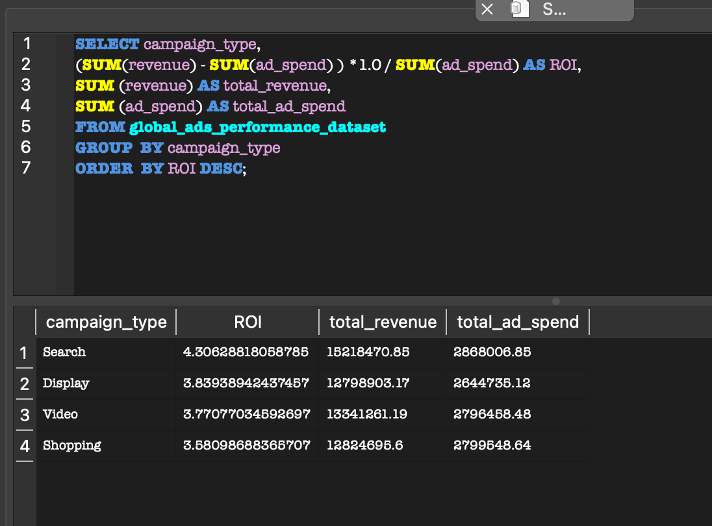

# Maha B. Kazmi - SQL Portfolio

I am a data-driven professional with experience in Marketing, Communications, and Data Analytics. This portfolio showcases SQL projects focused on business insights and data storytelling.

## Project Index
- 1. Global Marketing Campaign Analysis
- 2. Customer Segmentation Project
- 3. Car Sales Performance & Revenue Trends Analysis

## Skills
- SQL (Joins, Aggregations)
- Data Analysis
- Marketing Analytics

## Tools Used
- SQLite / DB Browser
- SQL
- GitHub
- Kaggle Dataset

## 📈 Global Marketing Campaign Analysis 

Business Problem

Soothe, a hand lotion company, wants to optimize its advertising budget using historical marketing campaign data. The goal is to identify the highest-performing campaigns and platforms to improve future marketing investment decisions.

Key Questions

- Which campaign generates the highest ROI?
- Which advertising platform performs best?
- Which campaigns should receive additional investment?

---

## Q1: Which campaign has the highest ROI?

-- Objective: Identify which campaign type generates the highest ROI...

SQL Query: 
```sql
SELECT 
  campaign_type, 
  (SUM(revenue) - SUM(ad_spend) )/ SUM(ad_spend) AS ROI
FROM global_ads_performance_dataset 
GROUP BY campaign_type 
ORDER BY ROI DESC;
```


### 📊 Results

| Campaign | ROI |
|---|---|
| Search | 430% |
| Display | 383% |
| Video | 377% |
| Shopping | 358% |

**A1: Our search campaign has the highest ROI**

---

## Q2: Which platform performs best?

-- Calculate ROI by advertising platform...

```sql
SELECT 
  platform,
  (SUM(revenue) - SUM(ad_spend)) * 1.0 / SUM(ad_spend) AS ROI
FROM global_ads_performance_dataset
GROUP BY platform
ORDER BY ROI DESC;
```


### 📊 Results

| Platform | ROI |
|---|---|
| Tik Tok Ads | 662% |
| Meta Ads | 466% |
| Google Ads | 247% |

**A2: Our TikTok Ads have the highest ROI, therefore performing the best.**

---

## Q3: Which campaign should we invest more in?

-- Calculate which campaign we should invest more in based on ROI, Revenue, and Ad Spend...

```sql
SELECT 
  campaign_type, 
  (SUM(revenue) - SUM(ad_spend) ) *1.0 / SUM(ad_spend) AS ROI,
  SUM (revenue) AS total_revenue,
  SUM (ad_spend) AS total_ad_spend
FROM global_ads_performance_dataset 
GROUP  BY campaign_type 
ORDER  BY ROI DESC;
```


### 📊 Results

| Campaign | ROI | Revenue | Ad Spend| 
|---|---|---|---|
| Search | 430% |15218470.85 | 2868006.85 |
| Display | 383% |12798903.17 | 2644735.12 |
| Video | 377% |13341261.19 | 2796458.48 |
| Shopping | 358% |12824695.6 |2799548.64 |

**A3: We should invest more in the Search Campaign because it has the highest ROI at 430%, along with the highest total revenue. In comparison, Display has good ROI but lower revenue, Video has moderate performance, and Shopping has the lowest ROI.**


# 📌 Conclusions

Based on the SQL analysis, the following conclusions were identified:

1. The **Search campaign** demonstrated consistently strong performance due to its historically high ROI and highest total revenue.

2. **TikTok Ads** emerged as the highest-performing advertising platform overall, generating the strongest ROI among all platforms analyzed.

3. Based on both profitability and efficiency metrics, increasing investment in **Search campaigns** could improve overall marketing effectiveness and maximize return on advertising spend.


