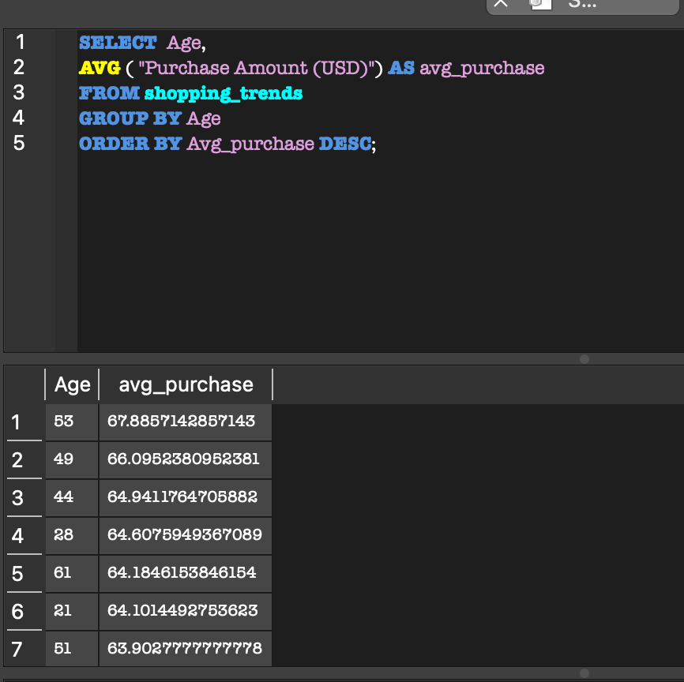
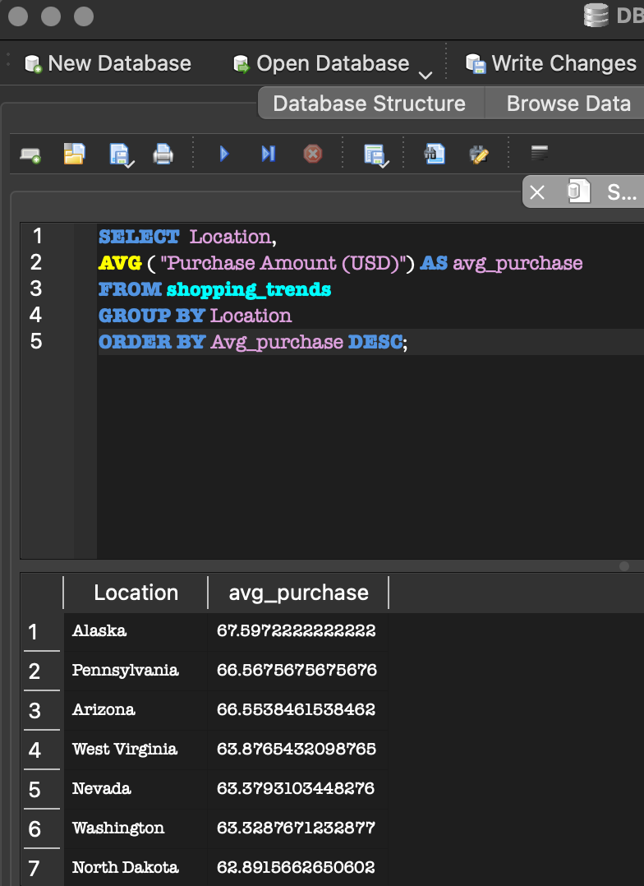
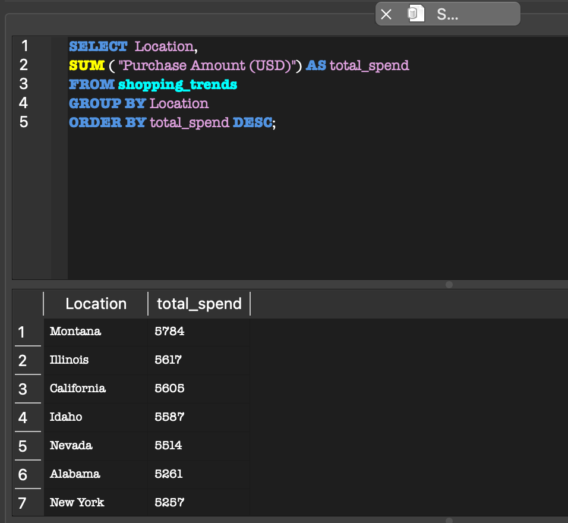
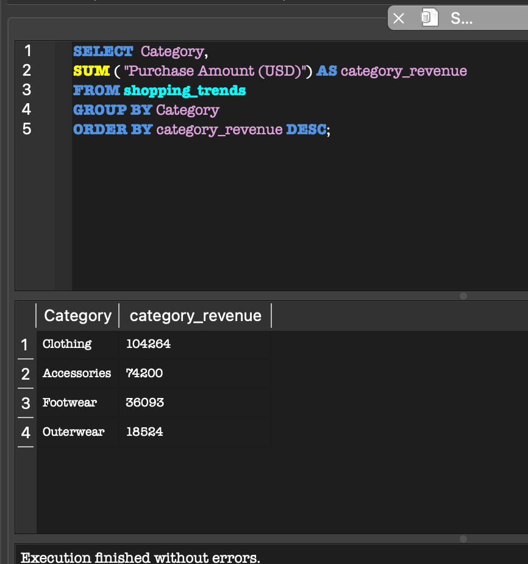

# Maha B. Kazmi - SQL Portfolio

I am a data-driven professional with experience in Marketing, Communications, and Data Analytics. This portfolio showcases SQL projects focused on business insights and data storytelling.

## Project Index
- 1. Global Marketing Campaign Analysis
- 2. Customer Segmentation Project
- 3. Coming Soon

## Skills
- SQL (Joins, Aggregations)
- Data Analysis
- Marketing Analytics

## Tools Used
- SQLite / DB Browser
- SQL
- GitHub
- Kaggle

# Dataset Customer Segmentation Analysis

## Goal
Analyze customer spending behavior and identify high-value customer groups.

## Questions Answered
- Which age group spends the most?
- Which region performs best?
- Which product category generates the most revenue?

---

## Q1: Which age group spends the most?

-- Objective: Identify which age range has the most disposable income.

SQL Query: 

```sql
SELECT  Age, 
AVG ( "Purchase Amount (USD)") AS avg_purchase 
FROM shopping_trends
GROUP BY Age
ORDER BY Avg_purchase DESC;
```


## Insights
- Customers aged 53 had the highest average purchase amount
- Customers between the ages of 49 and 54 consistently showed strong spending behavior
- Younger age groups generally spent less on average

A: Customers aged 53 had the highest average purchase amount

---

## Q1: Which region performs the best? 

-- Objective: Identify which region spends the most. 

SQL Query: 

```sql
SELECT  Location, 
AVG ( "Purchase Amount (USD)") AS avg_purchase 
FROM shopping_trends
GROUP BY Location
ORDER BY Avg_purchase DESC;
```



A: Alaska, Pennsylvania, and Arizona spend the most per order

But which location spends the most overall? 

SQL Query: 

```sql
SELECT  Location, 
SUM ( "Purchase Amount (USD)") AS total_spend
FROM shopping_trends
GROUP BY Location
ORDER BY total_spend DESC;
```


A: Montana, Illinois, and California spend the most overall.


## Q3: Which product category generates the most revenue?

SQL Query: 

```sql
SELECT  Category, 
SUM ( "Purchase Amount (USD)") AS category_revenue
FROM shopping_trends
GROUP BY Category
ORDER BY category_revenue DESC;
```


A: The clothing category generates the most revenue, followed by Accessories, footwear, and lastly outerwear.
