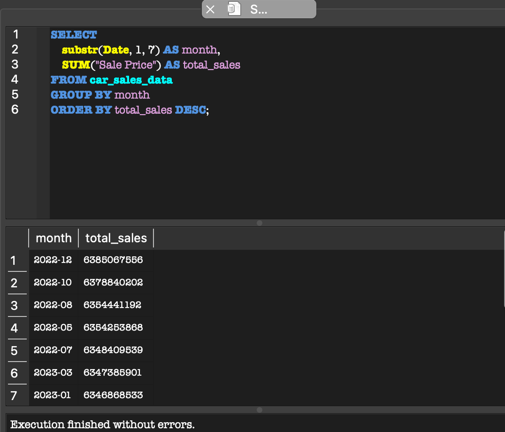

# Maha B. Kazmi - SQL Portfolio

I am a data-driven professional with experience in Marketing, Communications, and Data Analytics. This portfolio showcases SQL projects focused on business insights and data storytelling.

## Project Index
- 1. Global Marketing Campaign Analysis
- 2. Customer Segmentation Project
- 3. Car Sales Performance & Revenue Trends Analysis

## Skills
- SQL (Joins, Aggregations)
- Data Analysis
- Marketing Analytics

## Tools Used
- SQLite / DB Browser
- SQL
- GitHub
- Kaggle Dataset

--- 

## Which months had the highest sales?

SQL Query: 
```sql
SELECT 
    substr(Date, 1, 7) AS month,
    SUM("Sale Price") AS total_sales
FROM car_sales_data
GROUP BY month
ORDER BY total_sales DESC;
```


A: The top 3 months with the highest sales were December 2022, October 2022, and August 2022. 


---


## Are there seasonal spikes?

SQL Query: 
```sql
SELECT
  strftime('%Y-%m', Date) AS month,
  COUNT(*) AS total_sales
FROM car_sales_data
GROUP BY strftime('%Y-%m', Date)
ORDER BY month;
```

